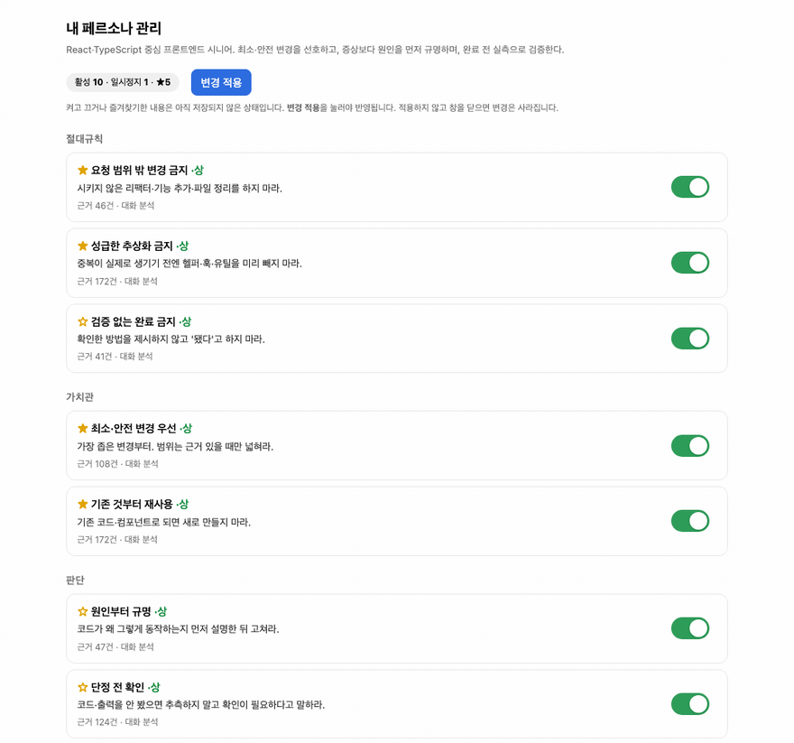

# work-like-me

[English](./README.md) · **한국어**

[](./LICENSE)


> 내 Claude Code / Codex 세션 로그로 **나만의 지시형 시스템 프롬프트**를 만든다 — 전부 로컬에서.

AI한테 매번 같은 잔소리를 반복하고 있지 않나요. *"시키지 않은 리팩터 하지 마"*, *"결론부터 말해"*,
*"완료라고 하기 전에 검증해"*. `work-like-me`는 로컬 세션 로그에서 이런 작업 스타일을 규칙으로 뽑아
지시형 시스템 프롬프트로 컴파일하고, 전역 AI 설정에 설치합니다. 한 번 해두면 모든 프로젝트가 내가
실제로 일하는 방식을 그대로 물려받습니다.

## 기능

- **데이터 기반** — 지어낸 게 아니라 실제 세션에서 뽑고, 규칙마다 근거(등장 빈도)가 붙습니다.
- **로컬·비공개** — 네트워크 호출 0. 분석 전에 시크릿과 홈 경로를 지웁니다.
- **지시형** — "~하라 / 하지 마라" 형태의 설치 가능한 프롬프트를 만듭니다. 설명문이 아니라.
- **직접 관리** — 규칙은 레지스트리에 있고, 로컬 대시보드에서 켜고 끄거나 즐겨찾기할 수 있습니다.
- **언어 선택** — 생성할 때 한국어/영어를 고르면 UI·프롬프트가 그 언어로.
- **자가 진화(선택)** — 대화가 쌓이면 훅이 새 신호를 모아 업데이트를 *제안*합니다.



> 규칙마다 카테고리·확신도·근거 수가 보입니다. 즐겨찾기(★)하거나 잠시 끄면 저장 전 상태로 표시되고,
> **변경 적용**을 눌러야 재컴파일·재설치됩니다. *(예시 페르소나라 실제 데이터 아님.)*

## 설치

**필요한 것:** [Claude Code](https://claude.com/claude-code) 또는 Codex CLI · Python 3

**Claude Code**
```text
/plugin marketplace add kayeonk/work-like-me
/plugin install wlm@kayeonk
```
설치 후 Claude Code를 재시작하면 스킬이 뜹니다. `/` 치면 `/wlm:create`가 보이면 성공.

**Codex**
```bash
codex plugin marketplace add kayeonk/work-like-me
codex plugin add wlm@kayeonk
```
Codex는 새 세션에서 잡힙니다. `$create`, `/skills` 피커, `@wlm`, 또는 말로 부릅니다.

설치했으면 이렇게만 말하면 됩니다 — **"내 페르소나 만들어줘"**. 어떤 것도 기기를 벗어나지 않습니다.

<details>
<summary>잘 안 될 때</summary>

- **스킬이 안 보임** → CLI 재시작(세션 시작 때만 로드). 확인: `/plugin marketplace list` (Claude) /
  `codex plugin marketplace list` (Codex).
- **`the name "wlm" is already taken`** → 예전 게 남아 있음. `/plugin uninstall wlm@<옛것>` 후 재설치.
- **업데이트** → `/plugin marketplace update kayeonk` 후 재설치·새 세션. Codex는 `codex plugin marketplace upgrade` + `codex plugin add …`.
- **`python3` 못 찾음** → `PATH`에 Python 3 필요.
</details>

## 스킬

| 스킬 | 명령 | 하는 일 |
|------|------|---------|
| create | `/wlm:create` | 로그에서 페르소나를 만들고 설치 |
| dashboard | `/wlm:dashboard` | 대시보드를 열어 규칙 켜기/끄기·즐겨찾기 후 적용 |
| update | `/wlm:update` | 새로 쌓인 신호를 검토해 규칙 변경 제안 |
| auto | `/wlm:auto` | 자동 제안 켜기/끄기 (Claude 전용) |

Codex에선 `$create` / `@wlm` / `/skills` 피커, 또는 그냥 말로. 풀스택처럼 한 사람이 여러 모드를
오가면, 따로 페르소나를 나누지 않고 **한 페르소나 안의 상황별 규칙**("FE일 땐 …", "BE일 땐 …")으로 담습니다.

## 어떻게 동작하나

```
소스 탐지 → 추출(+레닥션) → 샘플 → 표본 가드
→ LLM 귀납 → rules.json → 상황별 인터뷰
→ 컴파일·검토 → 설치(미리보기 → 적용)
→ 대시보드(즐겨찾기 / 끄기) → 제안형 진화
```

로그 스캔·레닥션·통계 같은 기계적인 일은 스크립트가 하고, **실제 판단 모델링은 LLM이 레닥션된 샘플을
읽고** 합니다. 그래서 언어·사람을 안 가립니다. 규칙은 `rules.json` 레지스트리에 모아뒀다가 프롬프트로
컴파일하고, 설치는 멱등적입니다(표시된 블록 안에만 쓰고, 처음 한 번 백업).

## 프라이버시

- **전부 로컬** — 네트워크 호출도, 텔레메트리도 없습니다.
- 샘플을 만들기 **전에** 지웁니다: 이메일, API 키(OpenAI/Google/AWS/Slack), GitHub 토큰, JWT,
  `Bearer` 헤더, `.env`식 시크릿, 긴 해시, IP, 그리고 **홈 경로(mac/Linux/Windows)** — OS 사용자명도 안 샙니다.
- 개인 데이터(`rules.json`, `.pending/`)는 플러그인 밖 `~/.work-like-me/`에 있어 배포물엔 안 들어갑니다.
- 다만 **완벽한 시크릿 제거기는 아닙니다.** 패턴 매칭이라 특이한 형식은 놓칠 수 있으니 설치 전에 한 번 훑어보세요.

## 관리 & 진화

- **대시보드** — `python3 dashboard.py`로 로컬(127.0.0.1) 페이지를 열어 클릭으로 켜기/끄기·즐겨찾기 후
  한 번에 재설치. `rules.json`을 직접 고쳐도 됩니다.
- **제안형 업데이트** — **"wlm 업데이트"**라고 하면 실행할 때마다 최근 Claude·Codex 세션을 직접
  스캔해(`capture.py --scan`) 바뀔 만한 규칙을 *제안*합니다. 승인 없이는 아무것도 안 바꿉니다.
- **자동 배지(Claude만)** — `auto` 스킬이 `SessionEnd` 훅으로 신호를 조용히 모으다 충분히 쌓이면
  대시보드에 알려줍니다. Codex엔 이 훅이 없지만 `update`가 양쪽을 스캔합니다.

## 한계

- 로그가 적으면 품질도 떨어집니다 — 100건 안 되면 신뢰도 낮다고 경고합니다.
- 세션 로그는 **"교정 지문"**이라 내가 반박·수정한 것에 편향됩니다. 결과는 완성품이 아니라 **손봐서
  쓰는 초안**으로 보세요.
- Claude(`~/.claude/CLAUDE.md`)·Codex(`~/.codex/AGENTS.md`) 전역 설정에 설치됩니다.

## 기여

의존성 0(Python 3 표준 라이브러리만) 원칙입니다. [CONTRIBUTING.md](./CONTRIBUTING.md)를 참고하세요 —
특히 `extract.py`의 레닥션을 건드릴 땐 규칙을 꼭 확인. 보안 관련은 [SECURITY.md](./SECURITY.md).

## 라이선스

MIT — [LICENSE](./LICENSE).
