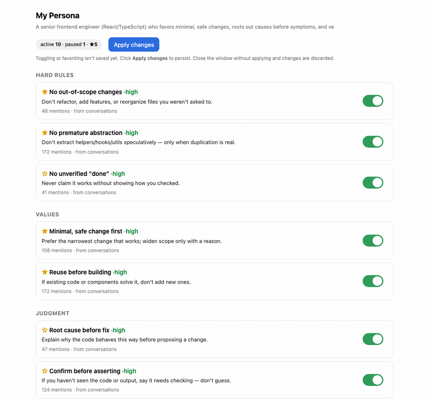

# work-like-me

**English** · [한국어](./README.ko.md)

[](./LICENSE)


> Build a personal, **directive system prompt** from your own Claude Code / Codex session
> logs — generated and installed **locally**.

You end up repeating the same corrections to your AI: *"don't refactor what I didn't ask for,"
*"lead with the answer,"* *"verify before you say it's done."* `work-like-me` reads your local
session logs, induces those working-style rules, compiles them into a directive system prompt, and
installs it into your global AI config — so every project inherits how you actually work.

## Features

- **Data-driven** — induced from your real sessions, with frequency evidence per rule.
- **Local & private** — no network calls; secrets and home paths are redacted before analysis.
- **Directive** — produces an installable `You must… / Do not…` prompt, not a description.
- **Manageable** — rules live in a registry; favorite / pause each one from a local dashboard.
- **Language-agnostic** — Korean or English UI and prompt, chosen at creation.
- **Self-evolving** — a SessionEnd hook (on by default, local-only) accumulates new signals and *proposes* updates over time. Turn it off anytime with the `auto` skill.



> The local dashboard: each rule with its category, confidence, and evidence count. Favorite (★) or
> pause rules, then **Apply** to recompile and reinstall. *(Sample persona — no real data.)*

## Installation

**Requirements:** [Claude Code](https://claude.com/claude-code) and/or Codex CLI · Python 3

**Claude Code**
```text
/plugin marketplace add kayeonk/work-like-me
/plugin install wlm@kayeonk
/reload-plugins
```
If `/reload-plugins` isn't available in your build, restart Claude Code. Then type `/` — you should see `/wlm:create`.

**Codex**
```bash
codex plugin marketplace add kayeonk/work-like-me
codex plugin add wlm@kayeonk
```
Start a new Codex session to pick up the plugin. Invoke with `$create`, the `/skills` picker, or `@wlm`.

Then just say **"make my persona"** (or "내 페르소나 만들어줘"). Nothing leaves your machine.

<details>
<summary>Troubleshooting</summary>

- **Skills don't appear** → restart the CLI (plugins load at session start). Verify with
  `/plugin marketplace list` (Claude) or `codex plugin marketplace list` (Codex).
- **`the name "wlm" is already taken`** → an older copy is installed; `/plugin uninstall wlm@<old>` then reinstall.
- **Update** → `/plugin marketplace update kayeonk`, reinstall, new session. Codex: `codex plugin marketplace upgrade` + `codex plugin add …`.
- **`python3` not found** → the scripts need Python 3 on your `PATH`.
</details>

## Skills

| Skill | Command | What it does |
|-------|---------|--------------|
| create | `/wlm:create` | Generate your persona from session logs and install it |
| dashboard | `/wlm:dashboard` | Open the local dashboard to favorite / pause rules and apply |
| update | `/wlm:update` | Review newly accumulated signals and propose rule updates |
| auto | `/wlm:auto` | Turn auto-suggested updates on/off (Claude only) |

In Codex, use `$create` / `@wlm` / the `/skills` picker, or just say what you want. Different work
*modes* (e.g. a full-stack dev's front-end vs back-end checkpoints) are captured as **situational
rules within one persona**, not separate profiles.

## How it works

```
detect sources → extract (+redact) → sample → sample-size guard
→ LLM induction → rules.json → situational interview
→ compile & review → install (preview → apply)
→ dashboard (favorite / pause) → evolve (proposal-based)
```

The mechanical work (scanning logs, redaction, stats) is done by scripts; the actual *judgment
modeling* is the LLM reading a redacted sample — so it works regardless of language or person. Rules
live in a registry (`rules.json`) and compile into the prompt; install is idempotent (writes only
inside a marked block, backs up first).

## Privacy

- Runs **100% locally** — no network calls, no telemetry.
- Redacted **before** anything is sampled: emails, API keys (OpenAI/Google/AWS/Slack), GitHub tokens,
  JWTs, `Bearer` headers, `.env`-style secrets, long hashes, IPs, and **home-directory paths
  (macOS/Linux/Windows)** so your OS username never leaks.
- Personal data (`rules.json`, `.pending/`) lives in `~/.work-like-me/`, outside the plugin — never shipped.
- **Not a guaranteed scrubber.** Redaction is best-effort pattern matching; review the compiled
  prompt before installing.

## Manage & evolve

- **Dashboard** — `python3 dashboard.py` opens a local (127.0.0.1) page to favorite/pause rules and
  reinstall in one click. Editing `rules.json` directly works too.
- **Proposal-based updates** — say **"wlm 업데이트"**; each run scans your recent Claude **and** Codex
  sessions (`capture.py --scan`) and *proposes* changes. Nothing is applied without your OK.
- **Auto-badge (Claude only, on by default)** — the plugin ships a `SessionEnd` hook that quietly
  accumulates signals locally and raises a dashboard badge. It doesn't touch your `settings.json`;
  the `auto` skill turns it off (opt-out flag). Codex has no such hook, but `update` self-scans both.

## Limitations

- Quality scales with log volume; under ~100 messages you'll be warned that confidence is low.
- Session logs are a **"correction fingerprint"** — they over-represent what you push back on. Treat
  the output as a strong draft to **edit**, not a finished profile.
- Installs into Claude (`~/.claude/CLAUDE.md`) and Codex (`~/.codex/AGENTS.md`) global config.

## Contributing

Dependency-free by design (Python 3 stdlib only). See [CONTRIBUTING.md](./CONTRIBUTING.md) —
especially the redaction rules if you touch `extract.py`. Security notes in [SECURITY.md](./SECURITY.md).

## License

MIT — see [LICENSE](./LICENSE).
